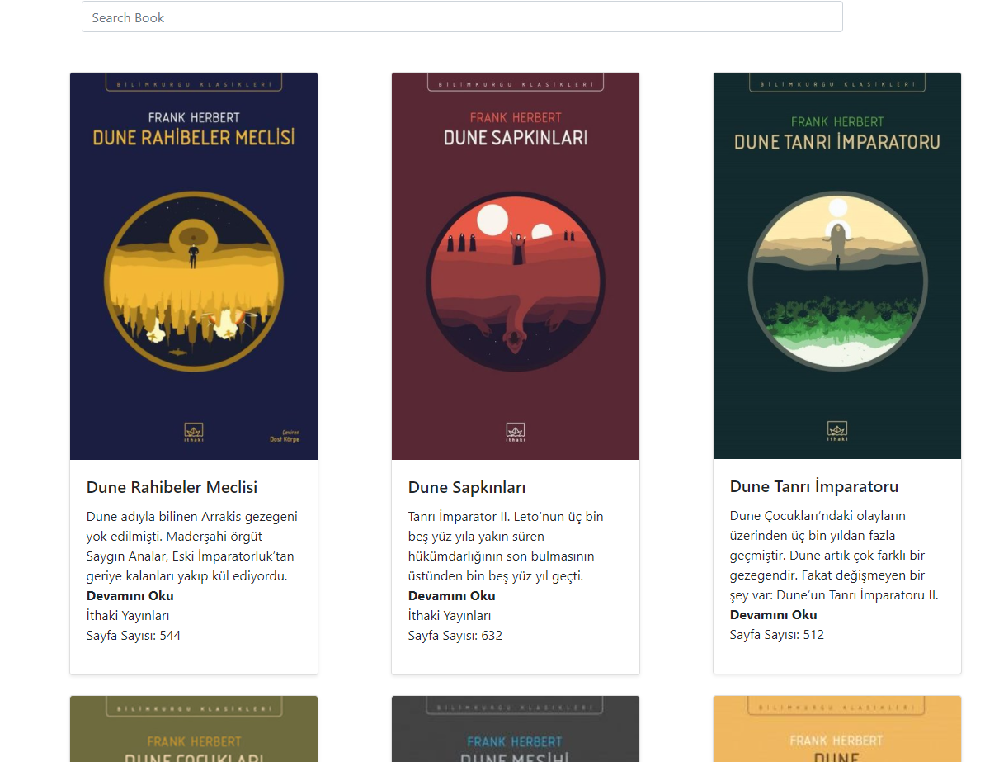

### Proje Nasıl Çalıştırılır

- Projeyi fork'ladıktan ya da indirdikten sonra projenin bulunduğu klasörde "npm install" komutu ile gerekli paketlerin yüklenmesi gerekiyor.
- Daha sonra "npm run start" komutu ile uygulama başlatılabilir.
- Json server'ı da başlatmak gerekiyor npx json-server --watch src/api/books.json --port 3002

### Proje Hakkında

Kendimce istediğim kitapları kendi oluşturduğum API içerisine yazdıktan sonra listeleme yapıyorum.

